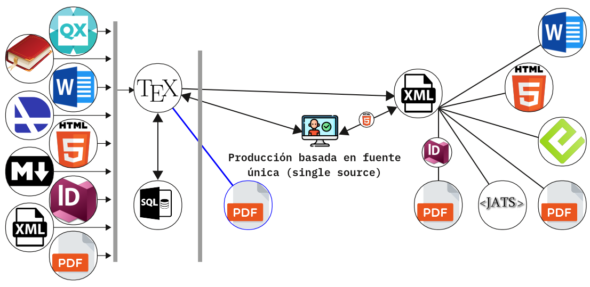

# gbTeXpublisher

gbTeXpublisher es una aplicación diseñada para facilitar la producción editorial de libros y revistas.

Adhiere al modelo de producción de fuente única [(_single source_)](https://en.wikipedia.org/wiki/Single-source_publishing), el mismo es un enfoque para flujos de trabajo de edición y publicación para producir diversos formatos de salida a partir de una única fuente de datos, gbTeXpublisher lo hace a través de LaTeX, pudiendo realizar salidas para PDF, HTML5, ePub, ODT y JATS.

Para una explicación con mayores detalles sobre el uso de esta aplicación, sus módulos y el proceso de edición ramificada, visite el [blog de la aplicación](https://albertomoyano.github.io/gbtexpublisher/).

# Licencia

El código fuente de gbTeXpublisher está disponible gratuitamente bajo una licencia GPL 3.0. La licencia completa está disponible en línea en https://www.gnu.org/licenses/gpl-3.0.en.html

